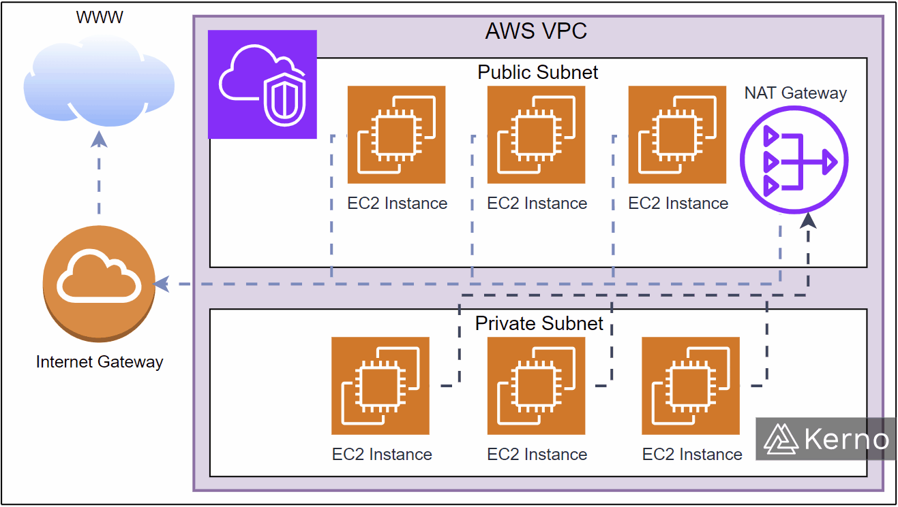

.png)
.png)

📘 AWS VPC (Virtual Private Cloud) — Complete Learning README

📌 What is AWS VPC?

An Amazon Virtual Private Cloud (VPC) lets you create a logically isolated private network in AWS where you can launch resources like EC2, RDS, and Load Balancers securely.

🧠 Why VPC is Important?

Full control over networking

Secure cloud infrastructure

Public & private subnet separation

Enables scalable, secure architectures

🏗 Core VPC Architecture Components

1️⃣ CIDR Block (IP Address Range)

Defines the IP address range of the VPC
Example: 10.0.0.0/16

Purpose:

Controls how many IPs your VPC can have

Divides network into subnets

2️⃣ Subnets

Subnets divide VPC into smaller networks.

Types:

Public Subnet — Internet accessible

Private Subnet — No direct internet access

Example CIDR:

Public: 10.0.1.0/24

Private: 10.0.2.0/24

3️⃣ Route Tables

Define where network traffic goes.

Example Routes:

0.0.0.0/0 → Internet Gateway (public subnet)

0.0.0.0/0 → NAT Gateway (private subnet)

4️⃣ Internet Gateway (IGW)

Allows internet access for public resources.

Used for:

Public EC2

Load Balancers

Bastion Hosts

5️⃣ NAT Gateway

Allows private subnet resources to access internet
(But blocks incoming internet traffic)

Used for:

Private EC2 updates

Secure backend servers

6️⃣ Security Groups (Instance Firewall)

Controls inbound & outbound traffic at instance level

Acts as:

Stateful firewall

Example:

Allow HTTP (80)

Allow SSH (22)

7️⃣ Network ACL (NACL)

Controls traffic at subnet level

Acts as:

Stateless firewall

Rule-based allow/deny

8️⃣ VPC Endpoints

Private connection to AWS services without internet

Types:

Gateway Endpoint — S3, DynamoDB

Interface Endpoint — PrivateLink

Benefits:

Secure AWS access

Lower latency

No NAT cost

9️⃣ Elastic IP (EIP)

Static public IP address for EC2 or NAT Gateway

🔟 DNS in VPC

AWS internal DNS resolution

Private Hosted Zones

Public Hosted Zones

1️⃣1️⃣ Availability Zones (AZs)

Subnets are placed in different AZs for high availability

1️⃣2️⃣ VPC Peering

Connects two VPCs privately

Use case:

Multi-account networking

Shared services

1️⃣3️⃣ Transit Gateway

Central hub connecting multiple VPCs and on-prem networks

Scalable enterprise networking solution

1️⃣4️⃣ VPN & Direct Connect

Secure connection between:

On-prem → AWS

Types:

Site-to-Site VPN

Client VPN

AWS Direct Connect

1️⃣5️⃣ Bastion Host (Jump Server)

Secure gateway to access private EC2

1️⃣6️⃣ Load Balancers in VPC

Application Load Balancer (ALB)

Network Load Balancer (NLB)

Used for traffic distribution

1️⃣7️⃣ Flow Logs

Capture network traffic logs for:

Security

Troubleshooting

Auditing

1️⃣8️⃣ Traffic Mirroring

Monitor & analyze live network traffic

1️⃣9️⃣ VPC Sharing (Resource Access Manager)

Share subnets across AWS accounts

2️⃣0️⃣ VPC Best Practices

Use least privilege security groups

Private subnets for backend

Avoid public IPs where not required

Enable Flow Logs

Multi-AZ architecture

🧩 Real-World Architecture Examples
✅ Public + Private Subnet Web App

Public: Load Balancer, Bastion

Private: EC2 backend, RDS

NAT Gateway for outbound internet

✅ Private-Only Secure App

No IGW

Uses VPC Endpoints

Internal ALB

✅ Hybrid Architecture

On-prem → VPN → AWS VPC

Transit Gateway hub model

📚 Suggested Learning Order

CIDR & IP addressing

VPC creation

Subnets & Route Tables

IGW & NAT Gateway

Security Groups & NACL

Endpoints & VPN

Peering & Transit Gateway

Real-world architectures

🧪 Practice Labs to Add

Create custom VPC from scratch

Deploy EC2 in public & private subnets

Configure NAT Gateway

Setup Bastion Host

Test VPC Peering

Create S3 Gateway Endpoint
